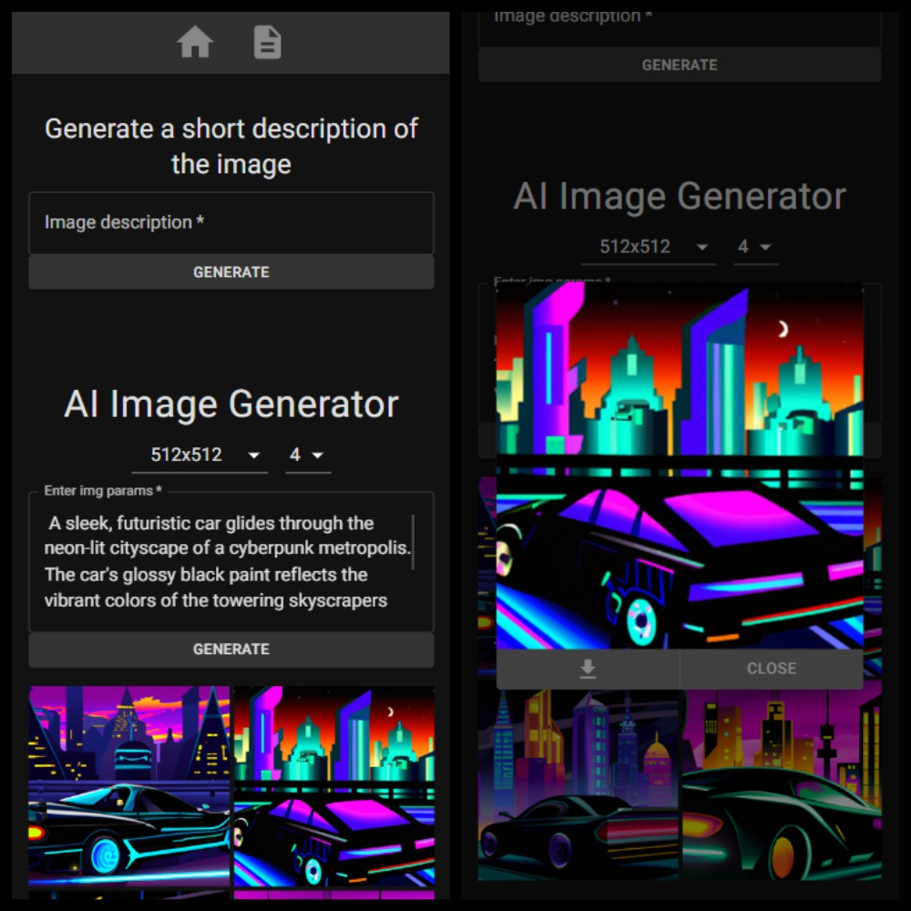
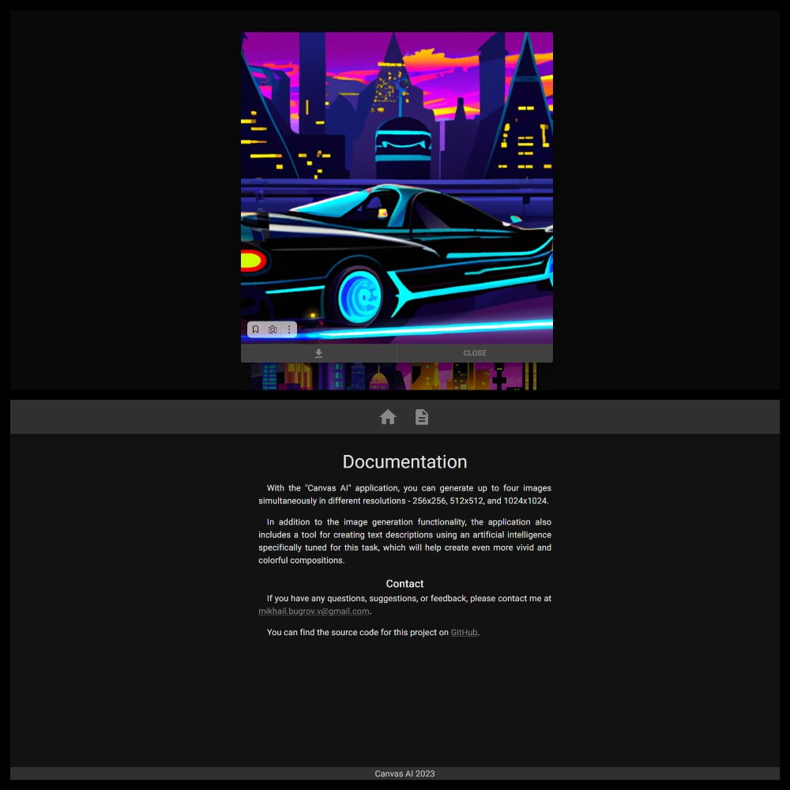
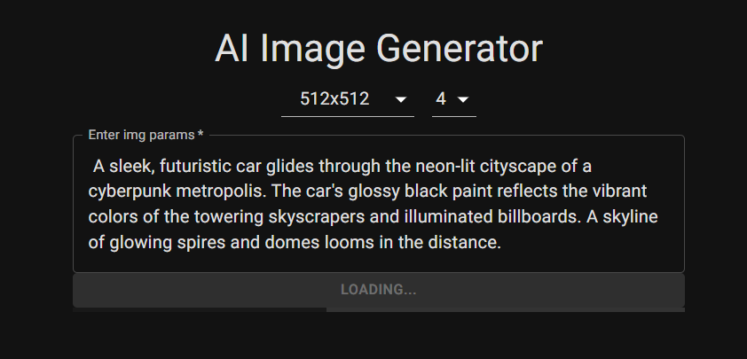

# Приложение "Canvas AI" на Next.js, TS, MUI и API OpenAI.

## Описание

С помощью приложения "Canvas AI" вы можете одновременно генерировать до четырех изображений разного разрешения - 256x256, 512x512 и 1024x1024.
Помимо функции генерации изображений, приложение также включает инструмент для создания текстовых описаний с использованием искусственного интеллекта, специально настроенного для этой задачи, что поможет создавать еще более яркие и красочные композиции.

## Статус проекта

Процесс обновления старого проекта на Next 13

## Предварительные настройки

Создайте файл `.env.local` в корневой директории проекта и добавьте строку `API_KEY=` с вашим api-ключом.

## Скриншоты интерфейса

## Контакты

Если у вас есть какие-либо вопросы, предложения или отзывы, пожалуйста, свяжитесь со мной по адресу [mikhail.bugrov.v@gmail.com](mailto:mikhail.bugrov.v@gmail.com)
